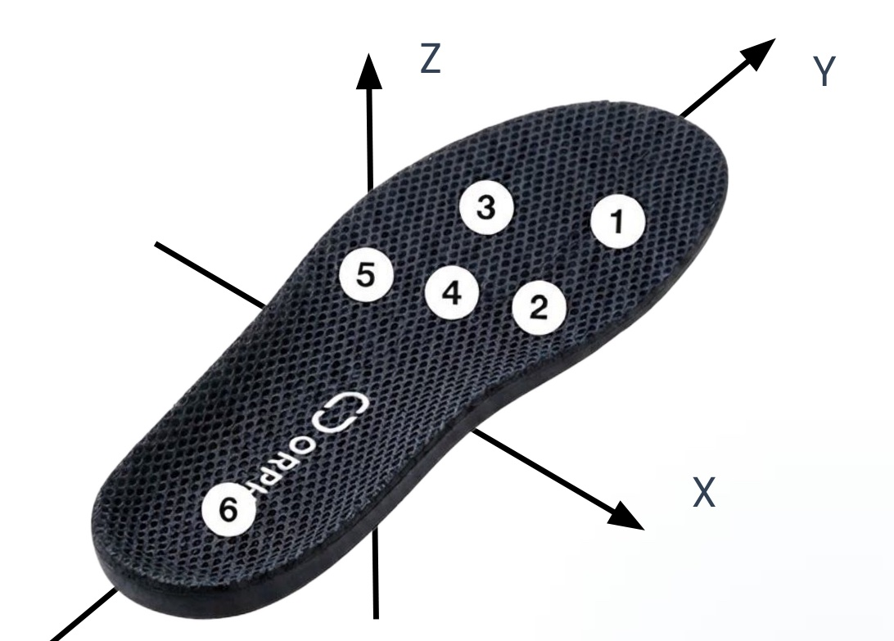
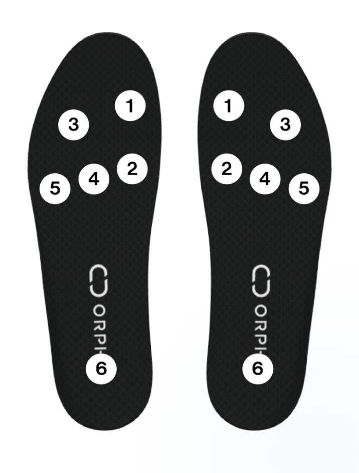

# ORPHE-INSOLE.js

[](https://orphe-oss.github.io/ORPHE-INSOLE.js/)
[](https://github.com/Orphe-OSS/ORPHE-INSOLE.js/releases)
[](https://github.com/Orphe-OSS/ORPHE-INSOLE.js/actions/workflows/ci.yml)

Happy hacking for ORPHE INSOLE module on javascript.

📖 **ドキュメント & デモサイト → https://orphe-oss.github.io/ORPHE-INSOLE.js/**
（全サンプルのカードギャラリー・API リファレンス・クイックスタートはこちら）

> [!CAUTION]
> 現在ベータ版での提供です。細かなチュートリアルやドキュメントは整備中です。動作確認やフィードバックをお待ちしています。

## 動作確認
まずは手元のORPHE INSOLEを[sensor dashboard](https://orphe-oss.github.io/ORPHE-INSOLE.js/examples/sensor-dashboard)ページで接続し、値が取得できるかを確認してみましょう

製品スペック・取得できるデータ・使い方をまとめて知りたい場合は [showcase](https://orphe-oss.github.io/ORPHE-INSOLE.js/examples/showcase) ページがおすすめです（実機が無くてもデモ再生で全ビジュアルが動きます）。

INSOLEを手に持って演奏するジェスチャ楽器のデモは [music-shoe](https://orphe-oss.github.io/ORPHE-INSOLE.js/examples/music-shoe) へ（クリック/キーボードでも試奏できます。ジェスチャ収録ツール [GESTURE LAB](https://orphe-oss.github.io/ORPHE-INSOLE.js/examples/music-shoe/lab.html) 付き）。

通信方式と計測モードを目的から選び、実機で可視化・記録まで試す場合は
[data-modes](https://orphe-oss.github.io/ORPHE-INSOLE.js/examples/data-modes/) を開いてください。
通常モード（リアルタイム通知）と FIFO（ロスレス収録）だけを比較する旧サンプルは
[fifo-vs-realtime](https://orphe-oss.github.io/ORPHE-INSOLE.js/examples/fifo-vs-realtime) に残しています。

## Getting Started
動作を確認できたら、以下のコードを利用して、ORPHE INSOLEの値を取得してみましょう。

```html
<!doctype html>
  <html lang="en">
    <head>
      <meta charset="utf-8">
      <title>ORPHE INSOLE JS</title>
    </head>
    <body>
      <h1>Hello, ORPHE-INSOLE.js!</h1>
      <button onclick="insole.begin();">connect</button>
      <p id="sensor-data"></p>
      <script src="https://cdn.jsdelivr.net/gh/Orphe-OSS/ORPHE-INSOLE.js@v1.2.1/dist/orphe-insole.min.js"></script>
      <script>
      var insole = new OrpheInsole(0);
      window.onload = function () {
        // ORPHE INSOLE Init
        insole.setup();
        insole.gotPress = function(press){
          document.getElementById("sensor-data").innerText = JSON.stringify(press)
        }
      }
      </script>
    </body>
  </html>
```

https://github.com/user-attachments/assets/209143e5-e53b-49f0-a1e5-10821334fa3a

### CDN
```
<script src="https://cdn.jsdelivr.net/gh/Orphe-OSS/ORPHE-INSOLE.js@v1.2.1/dist/orphe-insole.min.js"></script>
```
`OrpheInsole` は `Orphe` と同じクラスを指す別名です。既存コードの `new Orphe(0)` は引き続き利用できます。

### 実機がない場合（シミュレータ）
実機なしの開発やデモでは `OrpheInsoleSimulator` を使えます。`OrpheInsole` と同じ主なコールバックで、歩行・静止・重心揺れの合成データまたはCSV由来のフレーム配列を再生します。

```html
<script src="https://cdn.jsdelivr.net/gh/Orphe-OSS/ORPHE-INSOLE.js@v1.2.1/src/InsoleSimulator.js"></script>
<script>
const insole = new OrpheInsoleSimulator(0);
insole.setup();
insole.gotPress = press => console.log(press.values);
insole.gotConvertedAcc = acc => console.log(acc); // acc[G]
insole.begin({ preset: 'walk', streamingMode: 4 });
</script>
```

### Toolkitで計測モードを切り替えて記録する

`InsoleToolkit.js`、`InsoleFifo.js`、`InsoleGait.js`を読み込むと、低レベル設定を順番に変更せず、
実機検証済みの名前付きprofileを原子的に適用できます。

```js
buildInsoleToolkit(document.querySelector('#toolkit'), 'INSOLE 01', 0);
const session = getInsoleToolkitSession(0);

// ユーザが接続スイッチから実機を選択した後:
await session.applyProfile('realtime-full-step');
await session.startMeasurement({ metadata: { participant: 'P001' } });

// 計測する

const result = await session.stopMeasurement();
const rawCsv = insoleToolkitMeasurementToCSV(result, 'raw');
const stepCsv = insoleToolkitMeasurementToCSV(result, 'step');
```

主なprofileは`realtime-full`（全センサー100 Hz）、`realtime-orientation`（姿勢200 Hz）、
`realtime-pressure`（圧力+IMU 200 Hz）、`realtime-full-step`、`step-analysis`、
`fifo-recording`です。FIFOの`stopMeasurement()`は未回収データのdrain完了まで待ちます。
計測中のprofile変更は拒否されるため、正式計測区間のデータ形式を一定に保てます。
詳しい選び方と実機可視化は[`examples/data-modes/`](./examples/data-modes/)を参照してください。

### Tutorial
  * https://github.com/Orphe-OSS/ORPHE-INSOLE.js/wiki

### API Document
  * https://orphe-oss.github.io/ORPHE-INSOLE.js/docs/

## センサ座標系と圧力センサ配置 / Sensor coordinate system and pressure sensor placement

<p>


</p>

（図は公式「ORPHE INSOLE DEMO App 利用マニュアル」より / Figures from the official ORPHE INSOLE DEMO App User Manual）

センサ座標系は**右手系（Z-up）**です。

* **Y**: つま先方向（インソールの長軸方向）
* **X**: つま先方向に向かって右
* **Z**: インソール上面の法線方向（上向き）。静止時の加速度Zは約 +1G になります。

圧力センサは左右各6点で、番号は上図のとおりです（1 つま先内側 / 2 母趾球内側 / 3 つま先外側 / 4 中足部中央 / 5 中足部外側 / 6 踵）。
`gotPress` で受け取る `press.values[i]` はセンサ番号 `i + 1` に対応します。配置に依存するロジックを組む前に、つま先立ち・踵立ちなどで実機のチャネル対応を確認することを推奨します。

The sensor frame is **right-handed, Z-up**: **Y** points toward the toes (long axis of the insole), **X** to the right of the toe direction, and **Z** upward out of the insole top surface (accZ reads about +1G at rest).
Each foot has six pressure sensors numbered as in the figure (1 toe-medial / 2 ball-medial / 3 toe-lateral / 4 ball-center / 5 midfoot-lateral / 6 heel). `press.values[i]` corresponds to sensor `i + 1`. Verify the channel mapping on your own device (e.g. stand on the toes, then on the heel) before relying on placement-specific logic.

この仕様は公式の「ORPHE INSOLE DEMO App User Manual」に基づき、[DEMO Appマニュアルページ](https://orphe-oss.github.io/ORPHE-INSOLE.js/demo-app/)にも掲載しています。

## ORPHE INSOLE DEMO App（iOS）

ブラウザを使わず iPhone 単体で計測・CSVエクスポートしたい場合は、公式 iOS アプリ「ORPHE INSOLE DEMO App」があります。IMU・圧力センサの生データと歩容指標の記録、ARKit による姿勢推定との同時計測、CSV/JSON エクスポートに対応しています。

> [!NOTE]
> DEMO App は本ライブラリ（ORPHE-INSOLE.js）とは**別の配布物**で、TestFlight 経由で提供しています。
> 利用を希望される方は、[ORPHE INSOLE β 評価キット](https://shop.orphe.io/products/orphe-insole-%CE%B2-evaluation-kit)をご購入のうえ、ORPHE社の担当者宛に **Apple ID に紐づくメールアドレス**をメールでご連絡ください（2つのデバイスまでインストール可能）。担当者がわからない場合は[お問い合わせフォーム](https://orphe.io/insole)からご連絡ください。

使い方・出力データ仕様（`sensor-{left/right}.csv`、`landmarks.json`、`gait_analysis_{left/right}.csv`、`{left/right}-primary.csv`）・歩容指標の定義は [DEMO App マニュアル](https://orphe-oss.github.io/ORPHE-INSOLE.js/demo-app/) を参照してください。

If you prefer measuring on an iPhone without a browser, the official iOS "ORPHE INSOLE DEMO App" records raw IMU / pressure data with derived gait indicators and ARKit pose estimation, and exports CSV/JSON. It is distributed **separately from this library** via TestFlight: purchase the [ORPHE INSOLE β Evaluation Kit](https://shop.orphe.io/en/products/orphe-insole-%CE%B2-evaluation-kit), then email the address linked to your Apple ID to your ORPHE representative (installable on up to 2 devices). See the [DEMO App manual](https://orphe-oss.github.io/ORPHE-INSOLE.js/demo-app/) for usage and the output data reference.

## Usage policy and commercial use

ORPHE-INSOLE.js is developed as a JavaScript library for people using ORPHE INSOLE.

Following the current ORPHE-CORE.js policy, ORPHE-INSOLE.js v1.0.0 and later is free to use, modify, and study for:

* education and workshops
* academic and non-commercial research
* personal creative projects
* prototypes and internal experiments
* free apps and non-commercial services built with ORPHE INSOLE

If you use ORPHE-INSOLE.js to build a paid app, paid service, commercial SDK integration, commissioned product, or business service, please contact ORPHE for a separate commercial agreement.

This usage policy follows the ORPHE-CORE.js v1.4.0 and later policy for this repository.

## 利用方針と商用利用について

ORPHE-INSOLE.js は、ORPHE INSOLEを使う人のためのJavaScriptライブラリです。

現在のORPHE-CORE.jsの方針に従い、ORPHE-INSOLE.js v1.0.0以降では、以下の用途について、改変を含めて無償で利用できます。

* 教育・ワークショップ
* 大学・研究機関などでの非商用研究
* 個人制作
* 試作・社内検証
* ORPHE INSOLEを使った無償アプリ・非商用サービス

ORPHE-INSOLE.jsを使って、有料アプリ、有料サービス、商用SDK連携、受託開発、事業として提供するサービスを作る場合は、別途ORPHEとの商用契約が必要です。

この利用方針は、ORPHE-CORE.js v1.4.0以降の利用方針をこのリポジトリで踏襲するものです。

## 開発者向け情報
### 環境構築
必要なパッケージはnpmで事前にインストールしておきます。
```
git clone https://github.com/Orphe-OSS/ORPHE-INSOLE.js.git
cd ORPHE-INSOLE.js
npm install
```
### CDN用の圧縮ソースファイル生成
圧縮ソースファイルは/dist以下に置きます。orphe-insole.min.jsを生成するには、以下のコマンドを実行してください。/dist 以下の圧縮されたorphe-insole.min.jsが保存されます。
```
npm install terser --save-dev
```
```
npm run build:min
```

### APIドキュメント生成
ORPHE-INSOLE.jsのAPIドキュメントを生成するには、以下のコマンドを実行してください。ORPHE-INSOLE.jsファイルを直接jsdoc方式でコメントインして、以下のコマンドを実行するとdocs/にドキュメントが生成されます。jsdocの設定は、`jsdoc.json`に記述されています。ソースコードの変更があった場合に利用します。
```
npm run generate-docs
```
### テスト
```
npm test
```
`npm test` は SDK 本体、CoreToolkit、terminal example の構文チェックと、INSOLE の `SENSOR_VALUES` packet parser の Node.js テストを実行します。

 ##  BLE情報
 characteristicに関しては、device information, update sensor values, date timeの3つのサービスを利用しています。これはORPHE COREと同じUUIDです。
   * device information: 01a9d6b5-ff6e-444a-b266-0be75e85c064
   * update sensor values: f3f9c7ce-46ee-4205-89ac-abe64e626c0f
   * date time: f53eeeb1-b2e8-492a-9673-10e0f1c29026

### Device Information
coreの時とは異なり、sensor_valuesの値を取得形式を変更する手段になっています。任意のデータをwriteすることで以下の通りのデータ形式になります。
 * 0x0D,0x01：リアルタイムデータを取得（従来の200Hzデータ形式）
 * 0x0D,0x03: リアルタイム（ジャイロ、加速度、圧力）200Hz
 * 0x0D,0x04: リアルタイム（ジャイロ、加速度、圧力、クオータニオン）100Hz -- デフォルト

`begin()` の第1引数に options object を渡すことで、接続開始時の送信形式を指定できます。
```
insole.begin({ streamingMode: 4 }); // default: gyro, acc, pressure, quaternion at 100Hz
insole.begin({ streamingMode: 3 }); // gyro, acc, pressure at 200Hz
```

### Update Sensor Values
センサーの値を更新するためのサービスです。device informationを通じてデータを送信すると、送信フォーマットを変更することができます。デフォルトでは0x0D,0x04の100Hzreal time送信になります。

### Date Time
センサから送信されてくるタイムスタンプ情報を同期するために利用します。ユーザサイドからの操作は基本的には不要です。

## Requirements
 * float16.js, https://github.com/petamoriken/float16
 * quaternion.js, https://github.com/infusion/Quaternion.js

## Copyright and licensing
 * Copyright (C) 2025, Tetsuaki BABA and ORPHE.inc.
 * See the usage policy above for ORPHE-INSOLE.js v1.0.0 and later.
