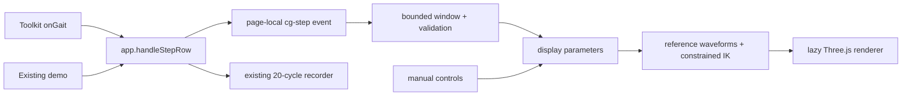

# Gait Report CG integration

The report frame is followed by a framework-free CG panel. No Sites URL, iframe,
React runtime, server, new npm dependency or change to the SDK is required.



## Ownership and interfaces

- `app.js` emits `gait-report:cg-step` **before** the recorder's early returns.
  Payload: `{side:'left'|'right', source:'live'|'demo', row:{...incomingRow}}`.
  It also emits `cg-reset` on clear/start, and `cg-disconnect` with `{side}`.
  These are local example events, not new SDK public APIs. The report recorder
  retains its original lifetime, source rules and 20-cycle cap.
- `feed.js`: pure, CJS-testable adapter using the existing `report.js` aggregation.
  Holds at most six valid rows per side, all received within eight seconds.
  Uses browser monotonic arrival time (not device time) for freshness. Source
  changes clear the window; no mixing demo and device data. Disconnect evicts that
  side. Missing/invalid speed or stride, non-walk/non-forward classification when
  present, and unsupported combinations are rejected rather than clamped.
  Invalid samples do not keep stale valid data alive.
- `panel.js`: owns manual parameters, auto/manual selection, animation phase,
  pause, camera and joints. Listeners are installed before app initialization.
  Manual body/posture settings remain while following. Turning following off
  restores the independent manual gait values. Clear resets the input window and
  phase, not the manual settings or user's follow/pause preference. If a demo or
  hardware stream is still running, following resumes on the next valid row.
- `model.js`: authoritative plain JavaScript for this example, initially ported
  from Gait Lab model `gait-reference-2.1.0`. It is not generated during SDK build.
  Includes the 101-point reference and its source SHA-256 metadata. Future edits
  should be made here and covered by the kinematic tests; there is no ongoing
  runtime/source dependency on the private prototype.
- `renderer.js`: geometry and camera only. No BLE, report DOM, or data mapping.
  Instance lifecycle is `createGaitCGRenderer(Three, element) -> {draw,dispose}`.

## Mapping and reproducibility

| Input | CG use | Caveat |
|---|---|---|
| `speed_mps` | speed (m/s), window mean | positive finite numbers only |
| `stride_norm_m` | window mean / 2 = step length (m) | same-side stride, not a step; left/right step lengths assumed symmetric |
| `stance_phase_s / duration_s` | stance percent by side | fallback cycle = positive stance + swing; missing side provisionally mirrored; both missing retain manual mean |
| `duration_s` | measured cadence retained as 120 / cycle | CG cadence fixed as 60 × speed / step; difference >2 steps/min disclosed |
| height, weight | body dimensions | manual; not inferred from shoe data |
| trunk lean, arm swing, step width, clearance, pelvis/trunk multiplier | synthesized motion | manual; not measured by these report fields |

No age/sex input. Unmeasured joint angles, contact angle, pronation, landing force,
root orientation and actual footfall timing are not reconstructed. Contact is
half-cycle offset; the reference cycle is repeated, **not synchronized to packet
arrival** (a packet describes a completed gait cycle). No physics, balance or
clinical validity claim. Measured temporal parameters may be inconsistent; the
fixed speed + step -> cadence rule is explicit and shared with manual mode.

Parameters ease with exponential time constant 350 ms without resetting phase.
The readout shows target values, while the rendered transition converges toward
them. Interpolated parameters are revalidated; if an intermediate combination is
unsupported the target is used. This does not guarantee continuous foot positions
when changing conditions; contact anchoring applies to a fixed parameter cycle.
Within a fixed configuration the model is deterministic. Browser animation is
frame-timed, not a raw-data recorder. The report remains the measurement artifact.

No samples: manual preview. Valid samples + following ON: automatic updates.
No fresh samples for >8 s, or unrepresentable combined settings: pause and hold
pose, show waiting/outside-range status. A single fresh side continues with an
explicit mirrored-stance note. The report may be finalized while CG remains live,
so their averaging windows and values intentionally differ.

## Loading, failure and performance

The panel markup and adapter work independently of WebGL. Three.js **0.185.1**
(MIT) is dynamically imported from the pinned jsDelivr npm URL only when the panel
enters the viewport (150 px margin). Its relative core module uses the same pinned
release. No measurements are sent to that CDN; the normal asset request exposes
network metadata. CDN/renderer failure is shown in the panel and leaves the
original report usable. Reload retries. WebGL-capable modern browser required.

Renderer skips drawing while offscreen or document hidden; parameter/readout
refresh is capped at 4 Hz except immediate gait/input updates. Pixel ratio <=2.
No unbounded sensor history. Animation dt capped at 50 ms after tab suspension.
Page exit disposes GPU objects/listeners; bfcache preserves them for resumption.
Print hides CG so the synthetic pose cannot be mistaken for a report measurement.

App-owned CG source/CSS/reference: ~54 KB uncompressed. Three is an additional
lazy network payload; the repository's <500 KB total target is not established
for this page. No mobile device performance or memory soak claim is made.

## Validation and Claude review guide

Run at repository root:

```sh
npm ci
node tests/gait-report-cg.test.js
npm test
npm run lint
npm run build
git diff --exit-code -- dist/ index.html en/
python3 -m http.server 8765
```

Open `/examples/gait-report/?demo=0` for manual mode; without `demo=0` the existing
page still automatically runs its synthetic demo (preserved behavior).

1. In manual mode change speed from 1.2 to 0.8: CG cadence changes from 110.8 to
   73.8 steps/min; set trunk lean 25 degrees; check visible forward lean.
2. Show joints, change camera, pause/play; orange markers remain visible.
3. Start demo: source becomes synthetic demo; four gait inputs lock and update;
   manual lean remains. Window counts never exceed 6 per side. Toggle following
   off: editable 0.8 manual speed returns, while the report continues recording.
4. Let demo reach 20/20: report finalizes unchanged; after 8 seconds CG waits and
   holds pose. Clear restores manual preview. JA/EN switch includes CG labels.
5. Device-only checks (NOT yet performed): pair L/R INSOLE in Realtime Full +
   Step mode, walk **without pressing Record**, then record 20/20 and continue
   walking. CG should update in all phases; report stays finalized after 20/20.
6. Vary actual speed, test single side/mount assignment, disconnect/reconnect,
   demo-to-real handover, gait notification loss, and invalid FW sentinel values.
   Confirm no demo sample in device window; missing side note; stop <=8.25 s after
   last valid arrival. Review whether the six-cycle window is sufficiently
   responsive on real firmware before merge.
7. Test mobile Chrome/Edge, CDN blocked, WebGL disabled, printing and long sessions.

Review highest-risk points: factor-of-two stride/cadence conversion, independence
of recorder and CG windows, reject vs clamp policy, stale-side removal, reference
license/provenance, behavior when manual height makes measured stride unreachable.

The Node tests cover conversion, missing/invalid values, cadence conflict,
bounds/expiry/source switch/disconnect/reset, observer delivery outside recording,
and kinematic limb length/sole penetration/periodicity. They do not emulate BLE
hardware, certify clinical realism, or replace the manual device checks above.
